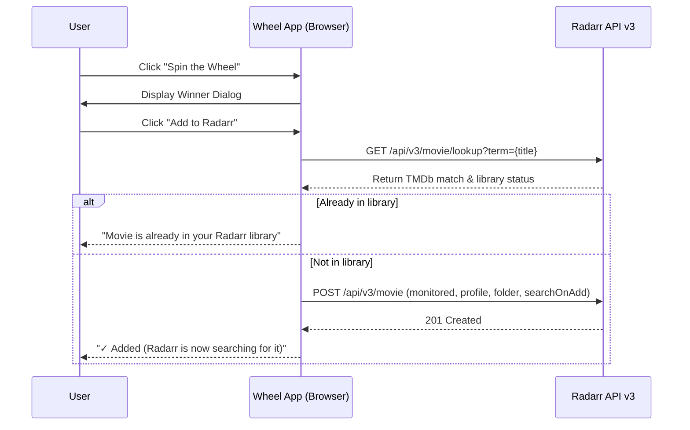

# Feature: Integrations (Radarr & Discord)

The **Letterboxd Watchlist Wheel** connects directly to your home media server and community channels through native integrations with **Radarr** and **Discord**.

---

## 1. Radarr Integration

The Radarr integration bridges movie night decisions into your self-hosted automation pipeline. When a movie wins on the wheel, you can queue it in your Radarr library with a single click.



### Configuration (Settings → Radarr)

To set up Radarr, open **Settings** (gear icon) and select the **Radarr** tab:

| Setting | Field ID | Description |
| :--- | :--- | :--- |
| **Radarr URL** | `#radarr-url` | The base URL of your Radarr instance (e.g. `http://192.168.1.100:7878` or `https://radarr.yourdomain.com`). Trailing slashes are stripped automatically. |
| **API Key** | `#radarr-api-key` | Your Radarr API key. Found in Radarr under **Settings → General → Security → API Key**. Includes a **Show / Hide** toggle button for privacy during screen sharing. |
| **Quality Profile** | `#radarr-quality-profile` | The quality tier Radarr should acquire (e.g. *HD - 720p/1080p*, *Ultra-HD*, or *Any*). Populated dynamically on connection test. |
| **Root Folder** | `#radarr-root-folder` | The media destination path where Radarr will store the film (e.g. `/movies` or `D:\Media\Movies`). Populated dynamically with live free disk space metrics. |
| **Search on Add** | `#radarr-search-on-add` | When checked, tells Radarr to immediately dispatch search tasks to your indexers upon adding the movie (`searchForMovie: true`). |

### Testing Connection & Auto-Population
1. Enter your **Radarr URL** and **API Key**.
2. Click **Test Connection**.
3. The app issues concurrent requests to `/api/v3/qualityprofile` and `/api/v3/rootfolder`.
4. If successful:
   * The status badge turns green: `Connected! Found X profile(s) and Y folder(s).`
   * The **Quality Profile** and **Root Folder** dropdowns unlock and populate with your server's live configurations and free storage metrics (e.g. `/data/movies (3.8 TB)`).
   * Select your preferred defaults; they are automatically persisted in `localStorage`.

### Adding Winners from the Winner Modal
Once configured, whenever the wheel crowns a winning film, the celebration dialog displays an **Add to Radarr** button:

1. **Click "Add to Radarr"**: The button updates to `Adding…`.
2. **Metadata Lookup**: The app searches Radarr's database using the film's title and release year.
3. **Duplicate Detection**: If the film is already cataloged in your Radarr database (`id > 0`), the app reports `"[Movie Title]" is already in your Radarr library.` without creating duplicate database rows.
4. **Queue & Search**: If not present, the app posts the TMDb ID, title, year, chosen profile, root folder, and search flags.
5. **Success Confirmation**: The button turns into a green `✓ Added` indicator and confirms: `"[Movie Title]" added to Radarr! Radarr is now searching for it.`

### CORS & Reverse Proxy Guidelines
Because this application runs entirely within your client browser, all API requests to Radarr are dispatched as native browser `fetch` calls.

> [!WARNING]
> If your Radarr instance is hosted on a different port or IP from the wheel without CORS headers enabled, your browser will block the request with a `Failed to fetch` error.

#### Recommended Solutions:
* **Reverse Proxy Headers**: If Radarr is served behind Nginx, Caddy, or Traefik, ensure standard CORS headers are configured for cross-origin requests:
  ```nginx
  # Example Nginx CORS configuration
  add_header 'Access-Control-Allow-Origin' '*' always;
  add_header 'Access-Control-Allow-Methods' 'GET, POST, OPTIONS' always;
  add_header 'Access-Control-Allow-Headers' 'X-Api-Key, Content-Type' always;
  if ($request_method = 'OPTIONS') {
      return 204;
  }
  ```
* **Caddy Example**:
  ```caddy
  header {
      Access-Control-Allow-Origin *
      Access-Control-Allow-Methods "GET, POST, OPTIONS"
      Access-Control-Allow-Headers "X-Api-Key, Content-Type"
  }
  ```

---

## 2. Discord Integration

The Discord integration allows you to broadcast winning spins automatically to a Discord channel, keeping remote watch party members, friends, or streaming communities updated in real time.

### Setting Up the Discord Webhook

1. **Create Webhook in Discord**:
   * In Discord, open your server and click **Edit Channel** (gear icon) on the target text channel.
   * Navigate to **Integrations → Webhooks**.
   * Click **New Webhook**, give it a name (e.g., *Movie Wheel*), and click **Copy Webhook URL**.
2. **Configure in Wheel**:
   * In the wheel app, open **Settings → Discord**.
   * Paste the URL into the **Webhook URL** field (`https://discord.com/api/webhooks/...`).
3. **Test Notification**:
   * Click the **Test Notification** button.
   * A test payload will instantly appear in your Discord channel confirming the connection.

### Rich Embed Notification Structure

When a movie wins on the wheel, a rich embed is automatically compiled and dispatched to your webhook:

```
+-------------------------------------------------------------------+
| ☸️ The Wheel has spoken!                                          |
|                                                                   |
| [Alien is the winner!]                                            |
| The Wheel has spoken! **Alien** was selected via **One Spin**.    |
| Praise the Wheel!                                                 |
|                                                                   |
| Odds                 Weight                 Letterboxd            |
| 14.3%                3x                     [View Movie]          |
|                                                                   |
| +-------------------------+                                       |
| |                         |                                       |
| |      [Movie Poster]     |                                       |
| |                         |                                       |
| +-------------------------+                                       |
|                                                                   |
| Wheelbur • via wheel.sensei.lol            Today at 8:45 PM       |
+-------------------------------------------------------------------+
```

### Embed Payload Details

| Field | Description |
| :--- | :--- |
| **Title** | `"[Movie Title] is the winner!"` |
| **Description** | Highlights the winning title and active spin mode (*One Spin*, *Movie Knockout*, or *Random Boost*). |
| **Embed Color** | Discord blurple (`0x5865F2`). |
| **Poster Image** | High-resolution poster image retrieved from movie metadata. |
| **Odds Field** | The precise mathematical probability of that movie winning at spin time (e.g. `14.3%`). |
| **Weight Field** | The movie's active slice weight multiplier (e.g. `3x`). |
| **Letterboxd Field** | Direct markdown hyperlink leading to the film's Letterboxd page. |
| **Footer & Timestamp** | Branded footer and exact ISO 8601 completion timestamp. |

> [!NOTE]
> Re-showing a past winner via the **Reshow Winner** button does *not* send duplicate Discord notifications (`context.isRestore` check).

---

## Related Documentation

* **[User Guide](User-Guide)**: Overview of spinning and winner celebration.
* **[Feature: Workspaces & Boards](Feature-Workspaces-and-Boards)**: How integration credentials persist across workspaces.
* **[Feature: Boost Station](Feature-Boost-Station)**: How boosts affect the odds reported in Discord notifications.
