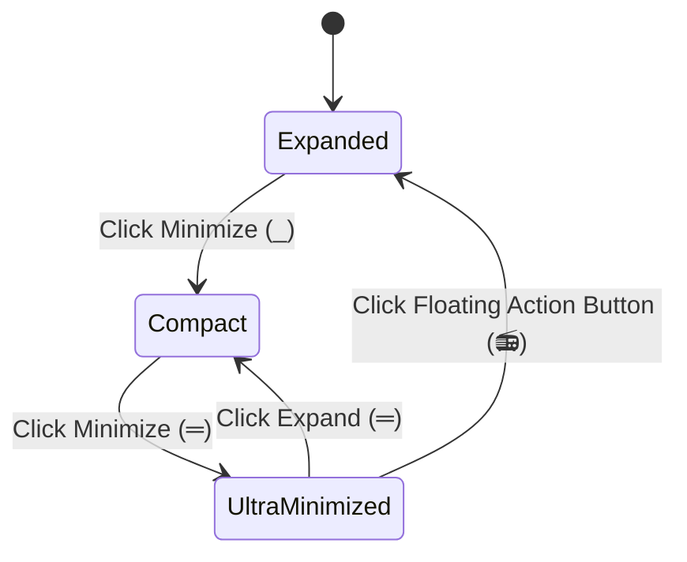

# Feature: Wheel.FM & Audio Synthesis

**Wheel.FM** is the integrated audio suite for the Letterboxd Watchlist Wheel. It pairs an atmospheric floating background radio player with real-time procedural sound effects synthesized directly via the Web Audio API.

---

## 1. Floating, Draggable Player Form Factor

Wheel.FM floats above the application workspace so you can curate your list and spin without interrupting playback.

* **Freeform Positioning**: Click and drag the player by its title header (`.wheel-fm__heading`) to place it anywhere on screen. When dragging, the cursor changes to `grabbing` and viewport edge collision detection ensures the player never slips off-screen.
* **Persistent Position Memory**: When released, coordinates are saved to `localStorage` (`wheel-fm-pos-x` and `wheel-fm-pos-y`). When you return to the app or switch boards, the player automatically restores its exact coordinates.
* **Responsive Recalibration**: On window resize, the player recalculates its bounding rect and automatically nudges inward if the viewport dimensions shrink.

---

## 2. Multi-Stage Minimization

The player features three visual footprint states to balance transport control with clean screen aesthetics:



| State | Visual Appearance | Functionality |
| :--- | :--- | :--- |
| **Expanded** | Full floating card | Displays track metadata, channel selector, track dropdown, volume slider, interactive seek scrubber, timestamps, and status feedback. |
| **Compact** | Slimmed card header | Minimizes vertical height (`is-minimized`) while keeping playback status, play/pause controls, and volume within quick reach. |
| **Ultra-Minimized (FAB)** | Circular floating button | Collapses into an unobtrusive Floating Action Button (FAB) displaying a radio icon (`📻`). Pulses gently when music is playing (`is-playing`). Can be dragged to any corner; clicking anywhere on the FAB instantly restores the player. |

> [!TIP]
> The minimization state is saved to `localStorage` (`wheel-fm-state`), preserving your preferred layout between sessions.

---

## 3. Multi-Channel Support & Custom Playlists

Wheel.FM broadcasts tracks defined in `wheel-fm/playlist.json`. It supports multiple themed broadcast channels as well as legacy flat playlists.

### Channel Dictionary Format (`playlist.json`)

To organize your audio library into distinct channels (e.g. ambient backgrounds, retro synthwave, or tension builders), use the channel map structure:

```json
{
  "Synthwave Lounge": [
    {
      "title": "Midnight Drive",
      "artist": "RetroWave",
      "file": "wheel-fm/tracks/midnight-drive.mp3"
    },
    {
      "title": "Neon Skyline",
      "artist": "Arcade Dreams",
      "file": "wheel-fm/tracks/neon-skyline.mp3"
    }
  ],
  "Cinema Suspense": [
    {
      "title": "Countdown to Reel",
      "artist": "Orchestral Hall",
      "file": "wheel-fm/tracks/countdown.mp3"
    }
  ]
}
```

### Legacy Flat Format Support
If your `playlist.json` uses a single flat array of track objects, Wheel.FM automatically wraps it into a **"Default Mix"** channel with full compatibility:

```json
[
  {
    "title": "Epic Spin Music",
    "artist": "Soundtrack Ensemble",
    "file": "wheel-fm/epic-spin.mp3"
  }
]
```

### Channel Selection & Switching
* The **Channel** dropdown menu lists all channels detected in `playlist.json`.
* Selecting a new channel instantly loads its track listing, pauses current audio, sets the first track, and updates the playlist status banner.

---

## 4. Player Controls & Seek Scrubber

Wheel.FM provides high-fidelity audio controls:

* **Transport Controls**:
  * **Play / Pause**: Starts or pauses audio. The play button and container toggle the animated `.is-playing` pulse.
  * **Previous / Next Track**: Skips backward or forward. Reaching the end of the playlist wraps automatically back to track one.
* **Volume Slider**: Smooth range slider (0% to 100%) with logarithmic gain normalization and persistent state.
* **Interactive Seek Scrubber**:
  * Precision range slider with 0.1-second step resolution.
  * Dragging the slider previews current scrub position in the elapsed timestamp without audio hitching.
  * Releasing jumps playback directly to the desired second.
* **Time Display**: Real-time dual display showing current elapsed time (`0:00`) alongside total track duration (`0:00`).
* **Track Metadata Display**: Displays the current track title and artist name with automatic truncation and fallback labels.

> [!NOTE]
> **Browser Autoplay Policies**: Modern browsers prohibit audio playback until the user has interacted with the document (such as clicking or pressing a key). If playback is blocked, Wheel.FM gracefully sets its status to `Ready to play. Playback was blocked.` until you click Play.

---

## 5. Procedural Web Audio API Sound Effects

Beyond background music, the wheel engine uses the native browser **Web Audio API** to generate low-latency procedural sound effects—without relying on static audio files or external downloads.

| Sound Effect | Function | Synthesis Specifications | Acoustic Description |
| :--- | :--- | :--- | :--- |
| **Mechanical Tick** | `playTickSound()` | Triangle oscillator at **600 Hz** with rapid 120ms exponential gain decay. | Simulates the tactile peg-and-flapper clicking of a physical carnival prize wheel passing each slice. |
| **Win Chime Chord** | `playWinSound()` | Staggered triad of sine oscillators: $C_5$ (**523.25 Hz**), $E_5$ (**659.25 Hz**), and $G_5$ (**783.99 Hz**) spaced 120ms apart with smooth 450ms exponential release. | A celebratory, melodic major chord arpeggio that rings out when a winning title is chosen. |
| **Knockout Elimination** | `playKnockoutSound()` | Sawtooth oscillator with exponential frequency sweep from **520 Hz down to 220 Hz** over 400ms, decaying over 500ms. | A punchy, retro arcade pitch down-sweep signaling that a film has been knocked off the wheel. |

### Sound Effects Mute Toggle
You can mute or unmute procedural wheel sound effects at any time using the sound toggle icon button near the wheel controls. Muting wheel sound effects does not affect Wheel.FM background music playback, allowing you to spin in quiet mode while keeping background music rolling.

---

## Related Documentation

* **[User Guide](User-Guide)**: Using controls and spinning the wheel.
* **[Feature: Knockout Mode](Feature-Knockout-Mode)**: The elimination game mode and knockout sound triggers.
* **[Developer Guide](Developer-Guide)**: Architectural details on audio synthesis and ES modules.
