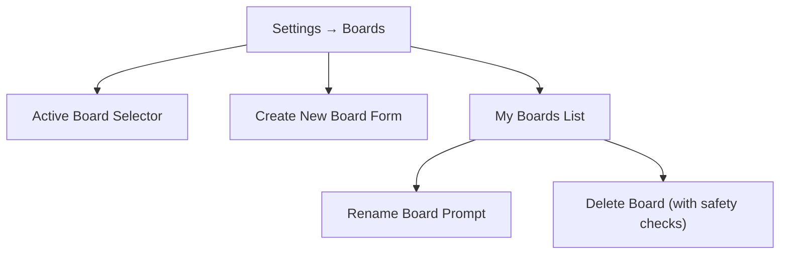

# Feature: Workspaces & Boards

The **Letterboxd Watchlist Wheel** includes a multi-board workspace manager designed to let you curate, save, and switch between multiple isolated movie collections—without juggling backup files or losing custom slice weights.

---

## 1. What are Boards and Workspaces?

Boards (workspaces) allow you to maintain distinct watchlists tailored to different occasions, genres, or groups of friends. 

Common workspace setups include:
* **Horror Marathon**: 31 horror films for October with custom boosts for cult classics.
* **Oscar Contenders**: Nominees and festival favorites for awards season.
* **Family Movie Night**: PG-rated animations and comedies curated for all ages.
* **Director Retrospective**: Complete filmographies (e.g. Denis Villeneuve or Hayao Miyazaki).
* **Date Night Shortlist**: A tight, agreed-upon pool of 10 movies.

Each board functions as an entirely independent universe within your local browser storage.

---

## 2. Isolated Board State

Every board stores its own dedicated state in `localStorage` under a unique UUID key (`letterboxd_workspace_<uuid>`). Switching between boards never mixes or overwrites:

| State Property | Scope | Description |
| :--- | :--- | :--- |
| **Movie Catalog** | Isolated | The list of imported and custom films on this board. |
| **Selection State** | Isolated | Checkbox states determining which movies are active on the wheel. |
| **Slice Weights & Colors** | Isolated | Custom weights (1x to 5x) and custom slice color assignments. |
| **Boost Contributions** | Isolated | Booster names, tags, and timestamps for movie night stakes. |
| **Winner History** | Isolated | The log of previous winners and champions spun on this board. |
| **Game Progression** | Isolated | Ongoing Knockout Mode elimination rounds. |
| **Tied Letterboxd URL** | Isolated | The Letterboxd list or watchlist URL bound to this board. |
| **Theme & Preferences** | Isolated | Selected visual theme, VHS capacity, and label toggles. |

---

## 3. Managing Boards: Create, Switch, Rename, Delete

Boards can be managed in two places:
1. **Quick Switcher Dropdown**: Located in the application header or curation card for instantaneous switching.
2. **Boards Management Panel**: Located in **Settings → Boards**.



### Creating a Board
1. Open **Settings** (gear icon) and select the **Boards** tab.
2. In the **Create New Board** card, enter a name (e.g. *Horror Month*).
3. Click **Create**.
4. The app generates a new unique ID (`crypto.randomUUID()`), initializes a fresh workspace, sets it as the active board, and saves the global index.

### Switching Boards
* Select any board from the **Active Board** dropdown in Settings or the board selector in the navigation bar.
* The application automatically:
  1. Saves the current board's state to disk.
  2. Updates `letterboxd_active_workspace_id`.
  3. Loads the destination board's movies, selections, weights, and history.
  4. Triggers the `letterboxd:workspacechange` event, refreshing the wheel canvas, slice editor, and history modal without requiring a page reload.

### Renaming a Board
1. In **Settings → Boards**, locate the board in the **My Boards** list.
2. Click **Rename**.
3. Enter the new name in the modal prompt and confirm. The index updates immediately while preserving all movie data and bindings.

### Deleting a Board
1. In **Settings → Boards**, click **Delete** on the target board.
2. Confirm the browser prompt.
3. The board's data key is removed from `localStorage`, and its entry is purged from the workspace index.

> [!CAUTION]
> **Safety Protections**:
> * You cannot delete the currently active board (the Delete button is disabled). Switch to another board first.
> * You cannot delete the last remaining board; the application requires at least one active board at all times.

---

## 4. Board URL Binding & 1-Click Syncing

Each board can be tied directly to a live Letterboxd list or watchlist URL.

### How Binding Occurs
When you import a Letterboxd URL in Step 1, that URL is automatically bound to the active board (`workspace.letterboxdUrl`). In **Settings → Boards**, your board displays its tied source:
```text
Horror Month
Last used: 10/31/2026 • 🔗 Tied to: username/list/spooky-season/
```

### 1-Click "Sync List" Banner
Whenever an active board has a bound URL, an active synchronization banner appears at the top of Step 1:

* **Direct Link**: Click the displayed URL to inspect the list on Letterboxd in a new tab.
* **Sync List Button**: Click **Sync List** to fetch the latest changes from Letterboxd in one click.
* **Smart Reconcile**:
  * Retains manually created custom titles.
  * Adds new titles discovered on Letterboxd.
  * Prunes titles that were removed from the Letterboxd list.
  * Restores customized slice weights for existing titles.
* **Hover Tooltips**: The resulting status banner shows interactive badges detailing the exact titles added or removed.

---

## 5. Board URL Conflict Resolution

Because watchlists are distinct, tying the same Letterboxd URL to two different boards could lead to confusion. The app actively monitors against duplicate bindings.

If you paste a Letterboxd URL into Board B that is already bound to Board A, the app displays the **Board Conflict** dialog:

```
+-------------------------------------------------------------+
| Board Conflict                                              |
|                                                             |
| This Letterboxd URL is already tied to a different board:   |
| "Horror Month".                                             |
|                                                             |
| Did you mean to update that board instead?                  |
|                                                             |
| [Cancel]  [Import into Current Board Anyway]  [Switch & Update]
+-------------------------------------------------------------+
```

* **Switch and Update** (*Recommended*): Automatically switches your active workspace to "Horror Month" and prompts to refresh or append there.
* **Import into Current Board Anyway**: Imports the films into your current board and unbinds the URL from "Horror Month".
* **Cancel Import**: Aborts the operation, keeping all boards and bindings intact.

---

## Related Documentation

* **[User Guide](User-Guide)**: General workflow for managing and spinning movie lists.
* **[Feature: Importing](Feature-Importing)**: Multi-page scraping, CSV uploads, and merge modes.
* **[Feature: Boost Station](Feature-Boost-Station)**: Awarding booster tags and stakes within a board.
